# Product Requirements Document (PRD)

## Hybrid Multi-Modal RAG Medical Diagnosis Support System

**Version:** 1.0  
**Document Type:** MVP PRD  
**Audience:** Reviewers, product leads, development team

> **Viewing Mermaid diagrams:** Open this file in Markdown Preview (Ctrl+Shift+V) or paste diagram code into [Mermaid Live Editor](https://mermaid.live).

---

## 1. Product Overview

**Hybrid Multi-Modal RAG Medical Diagnosis Support System** is an academic and portfolio MVP that provides AI-powered decision support for medical diagnosis. It is **not** a real clinical product and must not be used for autonomous diagnosis.

**Core value proposition:** The system combines multiple data modalities (X-ray images, clinical notes, lab values) with verified medical knowledge from vector search and knowledge graphs, then generates citation-backed diagnostic summaries. This addresses the reliability gap: text-only RAG ignores images and labs, while multi-modal LLMs hallucinate without grounding in verified sources.

**Key differentiator:** Hybrid retrieval (Vector DB + Knowledge Graph) plus cross-modal reasoning to reduce hallucinations and produce explainable, citation-backed outputs.

### High-Level System Architecture

---

## 2. Problem Statement

### Current Limitations

**Text-only RAG systems**
- Retrieve only text (PubMed papers, clinical notes)
- Ignore X-rays, scans, and lab values
- Miss critical diagnostic signals present in images and lab panels

**Multi-modal LLMs (images + text)**
- Can see images and read notes
- Hallucinate because they are not grounded in verified medical sources
- Often give answers without citations

In medicine, hallucinations are dangerous because decisions affect patient safety. Clinicians need trustworthy, explainable support—not black-box suggestions.

### What We Solve

We propose a **hybrid multi-modal RAG** framework that:
- Ingests images, text, and lab values
- Retrieves evidence from both unstructured (vector) and structured (knowledge graph) sources
- Cross-validates findings across modalities before generation
- Produces citation-backed summaries with explicit references (e.g., PubMed IDs, SNOMED codes)

---

## 3. Goals & Non-Goals

### Goals

| Goal | Description |
|------|-------------|
| **Trustworthy outputs** | Every diagnostic suggestion backed by retrievable evidence and citations |
| **Multi-modal fusion** | Integrate images, clinical notes, and lab values into a single reasoning flow |
| **Hybrid retrieval** | Use both vector similarity (similar cases) and knowledge graphs (disease–symptom–lab relationships) |
| **Explainability** | Clear supporting evidence, reasoning chain, and citation list |
| **MVP demonstration** | Working end-to-end prototype suitable for academic review and portfolio showcase |

### Non-Goals

| Non-Goal | Clarification |
|----------|---------------|
| Autonomous diagnosis | System assists; clinician makes final decision |
| Production deployment | MVP only; no hospital integration in scope |
| Regulatory compliance | HIPAA, FDA, etc. deferred to future scope |
| Real patient data | Use mock/synthetic data only |
| Full EHR integration | Out of scope for MVP |

---

## 4. Target Users

| User Type | Use Case |
|-----------|----------|
| **Students** | Learn how hybrid multi-modal RAG works in medical AI |
| **Researchers** | Evaluate architecture, metrics, and baseline comparisons |
| **Demo reviewers** | See end-to-end flow with mock inputs and citation-backed outputs |
| **Faculty / examiners** | Understand problem framing, solution design, and evaluation plan |

---

## 5. User Journey (Step-by-Step Flow)

1. **Open web UI**  
   User lands on a simple interface (Streamlit or React-style app).

2. **Upload mock X-ray image**  
   User selects a chest X-ray (e.g., `.png` or `.jpg`) from a predefined set or uploads a sample.

3. **Enter mock clinical notes**  
   User types or pastes text in a text box (e.g., "68-year-old male, fever, productive cough, shortness of breath").

4. **Enter mock lab values**  
   User fills form fields for key labs: WBC, CRP, Platelets (or similar).

5. **Submit query**  
   User clicks "Generate Diagnostic Summary" (or equivalent CTA).

6. **Wait for processing**  
   System runs embedding, retrieval, reasoning, and generation (e.g., 5–30 seconds).

7. **Review output**  
   User sees:
   - Possible diagnosis (with confidence indicator)
   - Supporting evidence (image findings, lab patterns, symptom matches)
   - Citations (mock PubMed IDs, SNOMED codes, case references)
   - Disclaimer that output is for educational/demo use only

8. **Optional: inspect citations**  
   User can click or hover on citation IDs to see source metadata (mock).

### User Journey Diagram

---

## 6. Functional Requirements

### 6.1 Frontend

| ID | Requirement | Mock Data Example |
|----|-------------|-------------------|
| F-FE-01 | Simple web UI (Streamlit or React-style SPA) | Single-page layout with clear sections |
| F-FE-02 | Image upload control for X-ray | Accept `.png`, `.jpg`; show preview; e.g., `chest_xray_sample.png` |
| F-FE-03 | Text input for clinical notes | Placeholder: "Enter clinical notes (e.g., age, symptoms, history)" |
| F-FE-04 | Form fields for lab values | WBC (×10⁹/L): 12.5, CRP (mg/L): 45, Platelets (×10⁹/L): 280 |
| F-FE-05 | "Generate Diagnostic Summary" button | Primary CTA; shows loading state during processing |
| F-FE-06 | Output panel for diagnosis | Example: "Findings suggest pneumonia (bacterial)." |
| F-FE-07 | Output panel for supporting evidence | Bullet list: opacity on RML, elevated WBC, fever + cough |
| F-FE-08 | Citations display | Mock IDs: PubMed PMID:12345678, SNOMED CT:233604007 |
| F-FE-09 | Confidence disclaimer | Text: "This is for educational/demo purposes. Not for clinical use." |
| F-FE-10 | Error handling | Show message if upload fails or API times out |

### 6.2 Backend

| ID | Requirement | Description |
|----|-------------|-------------|
| F-BE-01 | **Input module** | Validate and normalize image, text, and lab inputs |
| F-BE-02 | **Embedding module** | Encode text (BioBERT/PubMedBERT), images (CLIP/BioViL), labs (numerical vectors) |
| F-BE-03 | **Vector retrieval** | FAISS (or similar) for similarity search on embeddings |
| F-BE-04 | **Knowledge graph retrieval** | Neo4j + SNOMED/UMLS for disease–symptom–lab–treatment links |
| F-BE-05 | **Hybrid fusion** | Combine vector and KG results into a unified evidence set |
| F-BE-06 | **Reasoning module** | Cross-check modalities, filter contradictions, align image–lab–symptom findings |
| F-BE-07 | **Generation module** | Multi-modal LLM (LLaVA-Med/BioGPT) to produce summary with citations |
| F-BE-08 | **Citation injection** | Ensure outputs include explicit references (PMID, SNOMED, case IDs) |
| F-BE-09 | **Evaluation module** | Benchmark against text-only RAG and multi-modal LLM baselines |

### End-to-End Data Flow

```mermaid
flowchart LR
    subgraph User["User Input"]
        I1[🩻 Image]
        I2[📝 Notes]
        I3[🧪 Labs]
    end

    subgraph Pipeline["Backend Pipeline"]
        direction TB
        EMB[Embedding]
        VEC[Vector Search]
        KG[KG Query]
        FUSE[Hybrid Fusion]
        REASON[Reasoning]
        GEN[Generation]
    end

    subgraph Output["Output"]
        O1[Diagnosis]
        O2[Evidence]
        O3[Citations]
    end

    I1 & I2 & I3 --> EMB
    EMB --> VEC
    EMB --> KG
    VEC & KG --> FUSE
    FUSE --> REASON
    REASON --> GEN
    GEN --> O1 & O2 & O3
```

### Hybrid Retrieval Flow

```mermaid
flowchart TB
    QUERY[User Query + Inputs] --> EMB[Embeddings]
    EMB --> VEC
    EMB --> KG_Q

    subgraph Vector["Vector Path"]
        VEC[FAISS Similarity Search]
        VEC --> SIM[Similar Cases\nPast X-rays, Notes]
    end

    subgraph Graph["Knowledge Graph Path"]
        KG_Q[Neo4j Query]
        KG_Q --> REL[Disease–Symptom–Lab\nRelationships]
    end

    SIM --> FUSE[Evidence Fusion]
    REL --> FUSE
    FUSE --> REASON[Reasoning Module]
```

---

## 7. Non-Functional Requirements

| Category | Requirement |
|----------|-------------|
| **Performance** | End-to-end latency ≤ 60 seconds for typical query; retrieval < 5 seconds |
| **Explainability** | Every diagnosis must have traceable evidence (retrieval hits + KG paths) |
| **Safety** | Output must include disclaimer; no autonomous diagnosis claims |
| **Scalability** | MVP designed for single-user demo; no multi-tenant or load-balancing requirements |
| **Reproducibility** | Use fixed seeds, documented model versions, and mock datasets for repeatable runs |

---

## 8. Out of Scope (Clearly Listed)

- **Real patient data** — Only mock/synthetic data
- **Hospital / EHR integration** — No HL7, FHIR, or live system connectivity
- **Regulatory compliance** — HIPAA, FDA, CE marking, etc. deferred
- **Multi-user authentication** — Single-user demo
- **Mobile app** — Web UI only
- **Autonomous diagnosis** — Decision support only; clinician responsible for final call
- **Full SNOMED/UMLS coverage** — Subset sufficient for demo
- **Real-time streaming** — Batch processing per query

---

## 9. Success Metrics (Simple, Measurable)

| Metric | Target | Measurement |
|--------|--------|-------------|
| **Factual accuracy** | Higher than baseline | Compare against ground-truth labels on held-out set |
| **Hallucination rate** | Lower than multi-modal LLM baseline | Count unsupported claims in output |
| **Citation coverage** | ≥ 90% of key claims cited | Manual or automated check |
| **Cross-modal reasoning alignment** | Qualitative improvement | Expert review of image–lab–symptom coherence |
| **End-to-end demo success** | 100% | Demo runs without critical errors |
| **Latency** | < 60 seconds | Time from submit to final output |

---

## 10. Risks & Mitigations

| Risk | Mitigation |
|------|------------|
| **Hallucination** | RAG grounding; retrieval before generation; citation enforcement |
| **Misuse as autonomous tool** | Prominent disclaimers; no "diagnosis" wording without "suggested" / "support" |
| **Sensitive data exposure** | Use only mock/synthetic data; no PII |
| **Model bias** | Document training sources; note limitations in evaluation |
| **Technical failure** | Graceful error messages; fallback to "Unable to generate" with retry option |

---

## 11. Future Enhancements

| Enhancement | Description |
|-------------|-------------|
| **EHR integration** | Pull real clinical data (with proper governance) from FHIR/HL7 systems |
| **More modalities** | CT, MRI, pathology slides, vital signs |
| **Regulatory path** | Explore HIPAA compliance, FDA SaMD considerations |
| **Multi-language support** | Localized UI and clinical text handling |
| **User authentication** | Login, roles, audit logs for research use |
| **Expanded knowledge graph** | Full SNOMED/UMLS, drug–disease–treatment links |
| **Feedback loop** | Collect clinician ratings to improve retrieval and generation |

### Evaluation Baseline Comparison

---

## 12. Development Approach

This section provides full context for implementation: development phases, tech stack, API flow, module details, and suggested project structure.

### 12.1 Development Phases (Recommended Order)

### 12.2 Phase Dependencies (What to Build First)

### 12.3 Tech Stack Overview

### 12.4 API Request Flow (Sequence)

### 12.5 Embedding Module Detail (Per-Modality Flow)

### 12.6 Reasoning Module Flow (Cross-Modal Validation)

```mermaid
flowchart TB
    subgraph Evidence["Retrieved Evidence"]
        VEC_E[Vector: Similar cases]
        KG_E[KG: Disease–symptom–lab]
    end

    subgraph Align["Alignment Steps"]
        A1[Image findings ↔ Lab patterns]
        A2[Clinical symptoms ↔ KG facts]
        A3[Filter contradictions]
    end

    subgraph Output["Validated Evidence"]
        CONSISTENT[Consistent findings]
        FLAGGED[Flagged conflicts]
    end

    VEC_E --> A1
    KG_E --> A2
    A1 --> A3
    A2 --> A3
    A3 --> CONSISTENT
    A3 --> FLAGGED
    CONSISTENT --> GEN[Generation Module]
```

### 12.7 Suggested Project Structure

### 12.8 End-to-End Request Flow (Detailed)

---

## Appendix: Sample Mock Output

**Input**
- Image: Chest X-ray (opacity in right middle lobe)
- Notes: "68-year-old male, fever, productive cough, dyspnea"
- Labs: WBC 12.5, CRP 45, Platelets 280

**Sample output**
> **Suggested diagnosis:** Bacterial pneumonia (right middle lobe)  
>  
> **Supporting evidence:**  
> - Chest X-ray: Opacity in RML consistent with consolidation  
> - Clinical: Fever, productive cough, dyspnea align with lower respiratory infection  
> - Labs: Elevated WBC and CRP support bacterial etiology  
>  
> **Citations:**  
> - PMID:12345678 (Community-acquired pneumonia guidelines)  
> - SNOMED CT:233604007 (Pneumonia)  
>  
> *This output is for educational and demo purposes only. Not for clinical use.*
